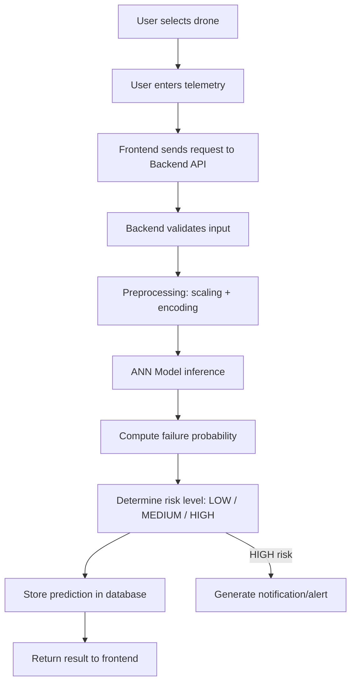
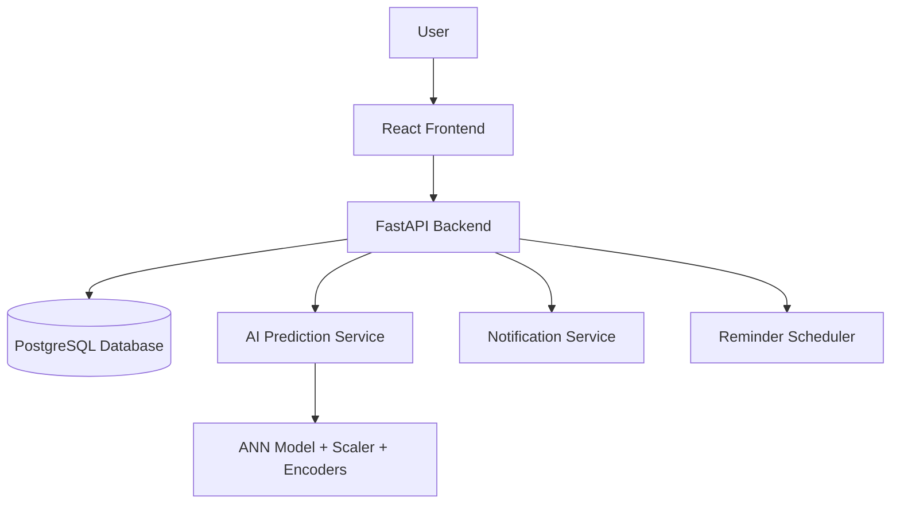
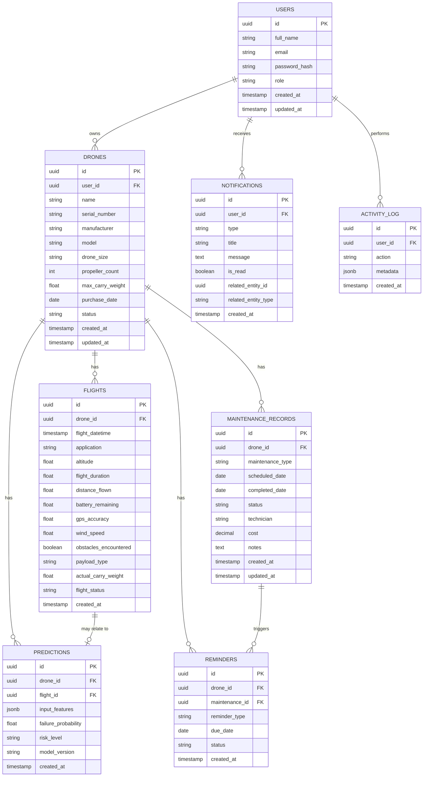

# DroneCare System Specification

**Document Type:** System / Product Specification (Planning Document Only — No Implementation)
**Version:** 1.0
**Status:** Draft — Pending Confirmation of Open Decisions

> This document defines what the final DroneCare application should be. It does **not** implement, modify, or replace the existing Streamlit prototype, ANN model, or ML artifacts. No code is written as part of this document. No commits or deployments are authorized by this document.

---

## Table of Contents

1. Executive Summary
2. Problem Statement
3. Proposed Solution
4. Target Users & Roles
5. Core Features
6. User Workflows
7. Application Pages
8. AI Architecture
9. System Architecture
10. Database Design (with ERD)
11. API Design
12. Frontend Architecture
13. Authentication & Access Control
14. Notifications
15. Reminders
16. Maintenance Management
17. Analytics
18. Drone Health Model
19. Error Handling
20. Security
21. Deployment
22. Email / Notification Infrastructure
23. Audit / Activity Log
24. Project Structure
25. MVP Scope
26. Future Roadmap
27. Development Phases (Start to End)
28. Product Principles
29. Open Decisions / Items Requiring Confirmation

---

## 1. Executive Summary

DroneCare is being redesigned from a single-file Streamlit ML demo into a production-oriented, full-stack, multi-user web platform for drone fleet health monitoring, AI-based failure-risk prediction, and maintenance management. The existing ANN model, scaler, encoders, and training pipeline form the **AI foundation** of the new system and will be integrated as a backend prediction service — not replaced or modified as part of this redesign. The end product is a persistent, deployable SaaS-style application, not a local demo.

## 2. Problem Statement

The current prototype:
- Runs only as a local/session-based Streamlit app with no persistence
- Has no user accounts, authentication, or data isolation between users
- Cannot store flight history, prediction history, or maintenance records
- Has no notification, alerting, or reminder capability
- Is not deployable as a real, ongoing product
- Uses a feature set that has not yet been confirmed as operationally correct (e.g., risk around post-flight-only fields such as Flight Duration)

## 3. Proposed Solution

Build a full-stack application with:
- **Frontend:** React + Vite SPA with a professional dashboard UI
- **Backend:** FastAPI (Python) REST API
- **Database:** PostgreSQL for persistent storage
- **AI Layer:** The existing ANN model wrapped as an internal backend prediction service, with model/scaler/encoder versioning and a centrally defined, configurable feature list
- **Notifications:** In-app notification center, architected to support email later
- **Maintenance & Reminders:** Full CRUD lifecycle with scheduled reminder logic

## 4. Target Users & Roles

| Role | MVP? | Description |
|---|---|---|
| Drone Operator | Yes | Primary user; manages their own drones, flights, predictions, maintenance |
| Administrator | Future | System-level configuration and user management |
| Maintenance Technician | Future | Performs/logs maintenance, may be assigned tasks |
| Organization Manager | Future | Oversees multiple operators and fleets within an org |

The MVP uses a **single practical role** (Drone Operator acting as owner of their own data), with the data model and access-control layer designed so Administrator, Technician, and Organization Manager roles can be added later without a schema rewrite.

## 5. Core Features

- Secure authentication (sign up, login, logout, password reset)
- Drone management (CRUD, search, filter, status)
- Flight & telemetry record keeping
- AI-powered failure-risk prediction
- Prediction history per drone
- Fleet health dashboard
- Notification center (alerts for risk, maintenance, status changes)
- Maintenance record management and scheduling
- Reminder system (upcoming/overdue maintenance, inspections)
- Analytics (fleet, flight, prediction, and maintenance statistics)
- User profile & account settings
- Activity/audit log

## 6. User Workflows

### 6.1 Onboarding
1. User signs up (name, email, password, confirm password)
2. User logs in
3. User adds their first drone
4. User is guided to record a flight or run a prediction

### 6.2 Prediction Workflow
1. Select a drone
2. Enter telemetry available at prediction time (no post-flight-only fields)
3. Submit prediction request
4. Backend validates → preprocesses → runs ANN model
5. Backend computes failure probability and risk level
6. Prediction stored in database, linked to drone + timestamp
7. Result shown to user; HIGH risk triggers a notification

### 6.3 Maintenance Workflow
1. User creates a maintenance record (manually, or system suggests one from a reminder/alert)
2. Record moves through statuses: Scheduled → In Progress → Completed (or Cancelled/Overdue)
3. Completing maintenance can update the drone's health status and clear related reminders

### 6.4 Notification Workflow
1. An event occurs (high-risk prediction, maintenance due/overdue, status change)
2. System creates a notification record
3. User sees it in the Notification Center, can mark as read, and can jump to the related drone/prediction/maintenance record

## 7. Application Pages

- **Auth:** Sign Up, Login, Forgot Password, Reset Password
- **Dashboard** — fleet overview, high-risk drones, upcoming maintenance, recent activity
- **My Drones** — list, search, filter, add drone
- **Drone Details** — info, health, predictions, flight history, maintenance history, alerts, analytics
- **Flights** — flight history list, add/view flight record
- **Predictions** — new prediction form, prediction results, prediction history
- **Maintenance** — maintenance list, create/edit record, schedule view
- **Notifications** — notification center
- **Analytics** — fleet/flight/prediction/maintenance charts
- **Profile / Settings** — account details, password change, preferences

## 8. AI Architecture

The ANN model, StandardScaler, and categorical encoders are treated as the **existing AI foundation** and are integrated as-is (pending validation), not rebuilt.

**Conceptual prediction flow:**



**Key principles:**
- Only features **operationally available at prediction time** may be required inputs (e.g., Flight Duration is excluded as a prediction input since it's only known post-flight; it may still be recorded in historical flight data).
- The feature list, order, and preprocessing steps are **centrally defined** (e.g., a single config/schema module) and validated against the model — never hardcoded independently in the frontend.
- Model, scaler, and encoders are **versioned together** so they can never drift out of sync.
- The model is **loaded once and reused** by the backend, not reloaded per request.
- Explainability (SHAP, feature importance) is a **future** capability; the system must not claim explanations it doesn't actually provide yet.

## 9. System Architecture



- Frontend, backend, and database are designed to be **independently deployable**.
- The backend is the only component with direct access to the database and the model.
- Notifications and reminders are backend-driven, not client-computed.

## 10. Database Design

**Recommended DB:** PostgreSQL

### Core Entities
- Users
- Roles (future-ready, minimal for MVP)
- Drones
- Flights
- Telemetry (may be embedded in Flights for MVP, or separate for future raw telemetry streams)
- Predictions
- Maintenance Records
- Maintenance Schedules
- Notifications
- Reminders
- Activity Log

### Entity Relationship Diagram



**Design notes:**
- All tables include `created_at`; mutable tables include `updated_at`.
- Foreign keys enforce that Flights, Predictions, Maintenance, and Reminders always belong to a Drone, which always belongs to a User.
- `input_features` on Predictions stores the exact input snapshot as JSON so historical predictions remain interpretable even if the feature list changes later.
- `model_version` ties every prediction to the exact model/scaler/encoder version used.
- Schema supports multiple drones per user and is extensible to multiple users per organization later (would add an `organizations` table + `organization_id` FKs).

## 11. API Design

**Recommended backend:** FastAPI + Python

| Endpoint | Method | Purpose |
|---|---|---|
| `/auth/register` | POST | Create a new user account |
| `/auth/login` | POST | Authenticate and issue a session/token |
| `/auth/logout` | POST | Invalidate session/token |
| `/auth/forgot-password` | POST | Request a password reset |
| `/auth/reset-password` | POST | Reset password via token |
| `/users/me` | GET | Get current user profile |
| `/users/me` | PUT | Update profile/settings |
| `/drones` | GET | List user's drones (search/filter) |
| `/drones` | POST | Add a drone |
| `/drones/{id}` | GET | Get drone details |
| `/drones/{id}` | PUT | Update drone |
| `/drones/{id}` | DELETE | Deactivate/delete drone |
| `/flights` | GET | List flights (filterable by drone) |
| `/flights` | POST | Record a flight |
| `/flights/{id}` | GET | Get flight detail |
| `/predictions` | POST | Submit telemetry, run prediction |
| `/predictions` | GET | List predictions (filterable by drone) |
| `/predictions/{id}` | GET | Get a specific prediction |
| `/maintenance` | GET | List maintenance records |
| `/maintenance` | POST | Create maintenance record |
| `/maintenance/{id}` | PUT | Update/complete/cancel maintenance |
| `/reminders` | GET | List active reminders |
| `/notifications` | GET | List notifications |
| `/notifications/{id}/read` | PUT | Mark notification as read |
| `/notifications/read-all` | PUT | Mark all as read |
| `/analytics/*` | GET | Aggregated fleet/flight/prediction/maintenance stats |

All endpoints except `/auth/*` require authentication. Each endpoint returns consistent error shapes (see Section 19) and enforces that a user can only access their own drones/data.

*(Endpoints are documented here for planning purposes only; implementation happens in later phases.)*

## 12. Frontend Architecture

**Recommended stack:** React + Vite

- Component-driven structure: pages, shared components, layout (sidebar/topbar), forms, tables, charts, modals
- Centralized API client with auth token handling and error interception
- Global state for auth/session and notifications
- Loading, empty, and error states for every data-driven view
- Client-side form validation mirrored by backend validation
- Design language: modern, professional, dark/dark-blue tech aesthetic, consistent typography/spacing, minimal decorative effects
- The ML feature list used in prediction forms is fetched from a backend-provided config/schema endpoint, not hardcoded in the frontend

## 13. Authentication & Access Control

- Sign Up: Full Name, Email, Password, Confirm Password
- Login / Logout
- Password hashing (e.g., bcrypt/argon2 — algorithm choice confirmed at implementation time)
- Forgot Password / Reset Password via time-limited token
- Session/token-based authentication (e.g., JWT) with expiry and refresh handling
- All application routes except auth pages are protected
- MVP: single-role, user-owns-their-data model
- Future: role-based access control (Admin, Technician, Org Manager) layered on top of the same schema

## 14. Notifications

Triggering events:
- High failure-risk prediction
- Critical battery condition
- Maintenance due / overdue
- Drone status change
- Other important system events

Notification Center supports: view, mark as read, mark all as read, filter, timestamps, and deep-linking to the related drone/prediction/maintenance record. Delivery is in-app for MVP; email/SMS is a future enhancement (see Section 22).

## 15. Reminders

Scheduled (not just dashboard-dependent) reminders such as:
- Maintenance due in 7 days
- Maintenance due tomorrow
- Maintenance overdue
- Inspection reminders (battery, motor, general)

Reminders are generated by a backend scheduler process and surfaced through the Notification Center and Dashboard.

## 16. Maintenance Management

- Create / edit / view maintenance records
- Schedule maintenance
- Mark completed / cancel
- Add notes
- Fields: Drone, Type, Date, Status, Description, Technician, Cost, Notes
- Statuses: Scheduled, In Progress, Completed, Overdue, Cancelled
- System automatically calculates upcoming/overdue status based on dates

## 17. Analytics

- Fleet statistics, flight statistics, risk distribution
- Failure prediction trends, maintenance statistics, drone utilization
- Battery and environmental-condition trends
- Charts are chosen for usefulness, not decoration; each chart should answer a specific operational question

## 18. Drone Health Model

Health states: **Healthy, Warning, Critical, Maintenance**

- Health is derived from documented, explainable rules (e.g., recent prediction risk level + maintenance status + overdue reminders), not an opaque score
- Exact scoring rules are an **open decision** to be confirmed before implementation (see Section 29)
- Architecture allows the health calculation logic to evolve without a schema change (e.g., a single health-calculation service/function)

## 19. Error Handling

The system handles, with user-safe messaging (no internal stack traces or sensitive details exposed):
- Invalid/missing input
- Invalid or expired authentication
- Database errors
- Model loading/prediction errors
- Network errors
- Unauthorized access (403) and not-found (404) cases

## 20. Security

- Password hashing; never store plaintext passwords
- Authentication + authorization on every protected endpoint
- Server-side input validation (not just client-side)
- Secrets/credentials stored in environment variables, never in source control
- CORS restricted to known frontend origins
- Rate limiting on sensitive endpoints (login, password reset)
- Safe, generic error responses to clients; detailed errors only in server logs
- File upload validation if/when uploads are introduced

## 21. Deployment

- Frontend, backend, and database deployable independently
- Docker / Docker Compose for local dev and deployment consistency
- Separate Development and Production environments
- Environment variables required for: database URL, auth secrets, API config, email config (future), model config/paths

## 22. Email / Notification Infrastructure

Architecture should allow future addition of:
- Welcome email
- Password reset email
- High-risk alert email
- Maintenance reminder email

No email provider is implemented in this phase; the notification service is designed with an abstraction so an email channel can be added later without redesigning the core notification logic.

## 23. Audit / Activity Log

Logged actions include: user login, drone created/updated, prediction generated, maintenance completed, notification generated. Supports traceability and future enterprise/compliance needs.

## 24. Project Structure

```
drone-care/
│
├── frontend/      # React + Vite application
├── backend/       # FastAPI application (routes, services, models, auth)
├── ml/            # ANN model, scaler, encoders, prediction service wrapper
├── notebooks/     # Existing training/exploration notebooks
├── docs/          # Specifications, architecture docs, ADRs
├── tests/         # Backend/frontend/ML test suites
├── docker/        # Dockerfiles, docker-compose configs
├── README.md
└── docker-compose.yml
```

*(Structure is proposed for planning only; not created as part of this document.)*

## 25. MVP Scope

- Authentication & user account
- Drone management
- Flight/telemetry records
- ANN-based prediction + prediction history
- Dashboard
- Notifications (in-app)
- Maintenance records + reminders

## 26. Future Roadmap

- Live telemetry / IoT integration, real-time monitoring
- Automatic telemetry ingestion
- SHAP-based explainability
- Email/SMS notification delivery
- Multi-organization support, advanced RBAC
- Mobile application
- Predictive maintenance forecasting
- Model monitoring and automatic retraining
- Multiple/competing ML models
- Third-party drone API integrations

## 27. Development Phases (Start to End)

| Phase | Goal | Main Tasks | Dependencies | Expected Result |
|---|---|---|---|---|
| 1. Architecture & Setup | Establish foundation | Repo structure, tooling, environment configs | None | Ready-to-build skeleton |
| 2. Database & Backend Foundation | Core persistence layer | Schema design, migrations, FastAPI skeleton | Phase 1 | Working DB + base API |
| 3. Authentication | Secure access | Sign up/login/logout, password hashing, tokens, reset flow | Phase 2 | Users can register & log in |
| 4. Drone Management | Core entity CRUD | Drone endpoints + UI pages | Phase 3 | Users manage drones |
| 5. Flight & Telemetry Management | Historical data capture | Flight endpoints + UI, data distinction from prediction inputs | Phase 4 | Flight history stored |
| 6. ANN Model Integration | Connect AI foundation | Wrap model/scaler/encoders as backend service, config-driven feature list | Phase 2, ML artifacts confirmed | Backend can run predictions |
| 7. Prediction History | Persist AI outputs | Prediction endpoints, storage, linking to drones | Phase 5, 6 | Predictions stored & viewable |
| 8. Dashboard & Analytics | Fleet visibility | Dashboard aggregation, analytics endpoints/charts | Phase 4–7 | Overview + insights available |
| 9. Notifications | Event-driven alerts | Notification service, triggers, notification center UI | Phase 7 | Users alerted on key events |
| 10. Maintenance & Reminders | Lifecycle management | Maintenance CRUD, scheduler, reminder generation | Phase 4, 9 | Maintenance tracked, reminders sent |
| 11. Security & Testing | Harden the system | AuthZ checks, input validation, rate limiting, test suites | Phases 3–10 | System is secure & tested |
| 12. Dockerization | Consistent environments | Dockerfiles, docker-compose for all services | Phase 11 | One-command local environment |
| 13. Deployment | Go live | Deploy frontend/backend/DB independently, configure envs | Phase 12 | Publicly accessible system |
| 14. Production Polish | Refinement | Performance tuning, UX polish, monitoring/logging | Phase 13 | Production-ready product |

## 28. Product Principles

1. DroneCare is a real system, not just an ML demo.
2. The AI model is one component of the system, not the entire system.
3. Predictions must use only operationally available data.
4. User data must be persistent in a database.
5. Authentication and authorization must protect user data.
6. Every prediction must be traceable to a drone and timestamp.
7. High-risk predictions must be capable of generating alerts.
8. Maintenance history must be connected to individual drones.
9. The architecture must be scalable.
10. The application must be deployable.
11. The system must be designed for future real-time telemetry integration.
12. Do not claim features as "real-time" or "explainable" unless actually implemented.

## 29. Open Decisions / Items Requiring Confirmation

These must **not** be assumed silently before implementation begins:

- Final confirmed ML feature set, order, and preprocessing steps (current 13-feature list is provisional pending pipeline validation)
- Whether current ANN model/scaler/encoder artifacts are approved for production use, or require retraining first
- Exact numeric thresholds separating LOW / MEDIUM / HIGH risk
- Exact rules for computing overall Drone Health status
- Authentication token strategy (e.g., JWT vs. session cookies) and expiry/refresh policy
- Hosting/deployment targets for frontend, backend, and database
- Whether email delivery is required for MVP or deferred
- Initial role scope: single-role MVP vs. introducing Admin/Technician roles earlier
- Whether Telemetry is modeled as its own table or embedded within Flights
- Multi-organization / multi-tenant timeline and its impact on the schema

---

**End of specification. No implementation, modification of existing artifacts, or deployment is authorized by this document.**
